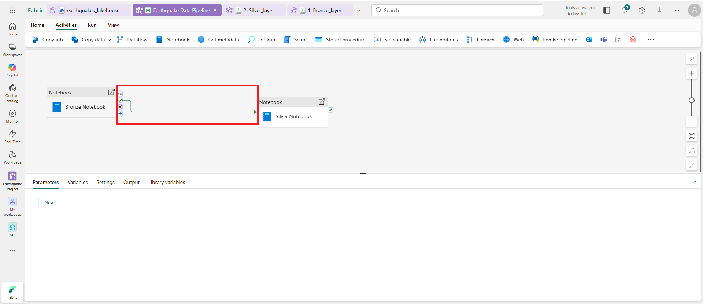
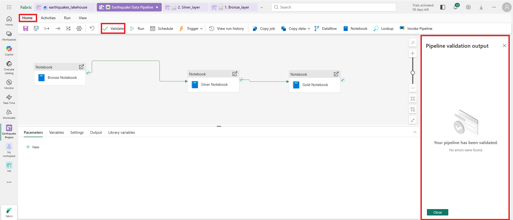
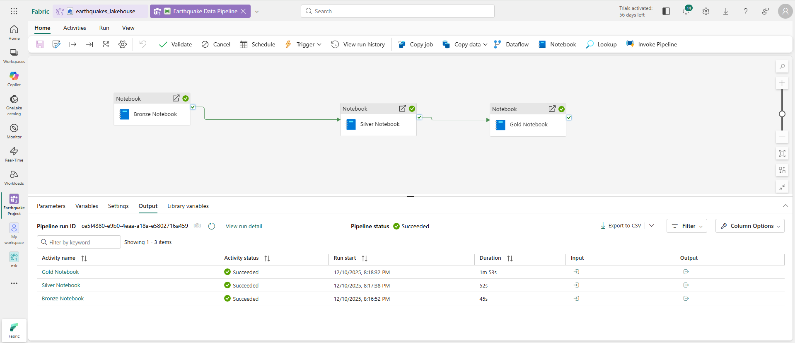

# Worldwide Earthquake Data Pipeline on Microsoft Fabric

## Project Overview
This project implements an end-to-end Data Engineering pipeline using **Microsoft Fabric**. It utilizes the **Medallion Architecture** (Bronze, Silver, Gold) to ingest, process, and enrich worldwide earthquake data from the USGS API.

The pipeline is orchestrated using Fabric Data Pipelines and utilizes Spark Notebooks for data transformation.

## Architecture
The solution follows a Lakehouse architecture pattern:
1.  **Bronze Layer:** Ingests raw JSON data from the USGS API.
2.  **Silver Layer:** Flattens JSON structures, converts data types, and creates Delta tables.
3.  **Gold Layer:** Enriches data with country codes (using Reverse Geocoding) and classifies earthquake significance.

## Prerequisites
* Microsoft Fabric Workspace
* Fabric Lakehouse (`earthquakes_lakehouse`)
* **Custom Environment:** A Spark environment named `Earthquake_env` with the `reverse_geocoder` library installed.

## Pipeline Components

### 1. Bronze Layer (Ingestion)
* **Type:** PySpark Notebook
* **Function:** Connects to the USGS Earthquake API using dynamic `start_date` and `end_date` parameters.
* **Output:** Saves raw data as JSON files in the Lakehouse Files section.
* **Key Code:** Uses `requests` to fetch GeoJSON data.

### 2. Silver Layer (Transformation)
* **Type:** PySpark Notebook
* **Function:** Reads the raw JSON files, selects relevant columns (magnitude, place, time, geometry), and casts Unix timestamps to standard Timestamp types.
* **Output:** Appends data to the `earthquake_events_silver` Delta table.

### 3. Gold Layer (Enrichment)
* **Type:** PySpark Notebook
* **Function:** * Filters data based on the execution date.
    * **Geospatial Enrichment:** Uses `reverse_geocoder` to derive the `country_code` from Latitude and Longitude.
    * **Classification:** Adds a `sig_class` (Low, Moderate, High) based on the earthquake's significance score.
* **Output:** Appends final analytical data to the `earthquake_events_gold` Delta table.

## Orchestration
The workflow is managed by a Fabric Data Pipeline. It passes dynamic parameters (yesterday's date) to the notebooks to ensure incremental loading.

### Pipeline Flow
The pipeline creates a sequential dependency: `Bronze -> Silver -> Gold`.
*(See the workflow configuration below)*

### Dynamic Parameters
The pipeline uses Fabric expression language to calculate dates dynamically:
* `start_date`: `@formatDateTime(addDays(utcNow(),-1),'yyyy-MM-dd')`
* `end_date`: `@formatDateTime(utcNow(),'yyyy-MM-dd')`

## Execution & Monitoring

### Validation
Before running, the pipeline is validated to ensure no parameter or connection errors.

### Pipeline Run
The pipeline is executed manually or via schedule. The screenshot below shows the successful execution of all three notebook activities.

## Setup Instructions
1.  **Create Lakehouse:** Create a new Lakehouse named `earthquakes_lakehouse`.
2.  **Import Notebooks:** Import the Bronze, Silver, and Gold notebooks into your Fabric Workspace.
3.  **Setup Environment:** Create a Fabric Environment, install `reverse_geocoder`, and attach it to the Gold notebook.
4.  **Create Pipeline:** * Add the notebooks to a new pipeline.
    * Connect them sequentially.
    * Configure the `start_date` and `end_date` parameters in the Settings tab of each activity.
5.  **Schedule:** Set the pipeline to run daily.
