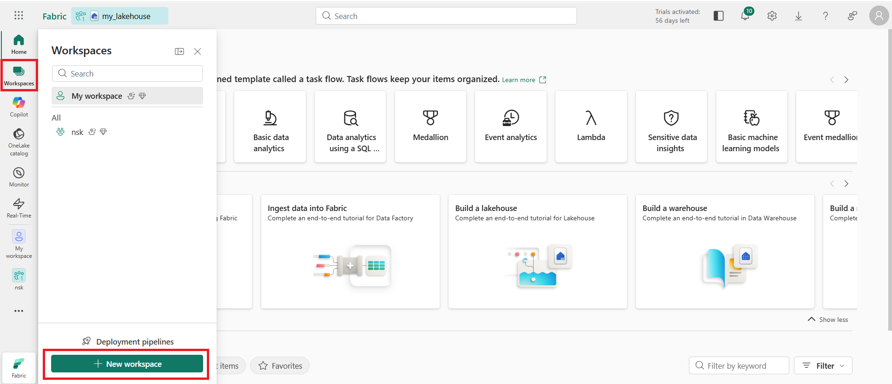
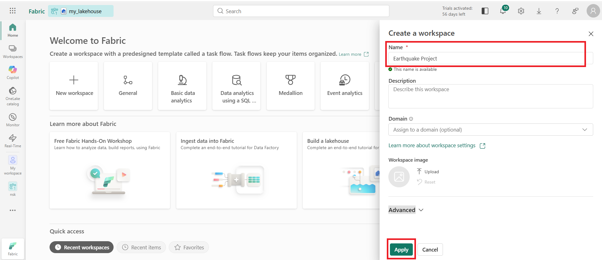
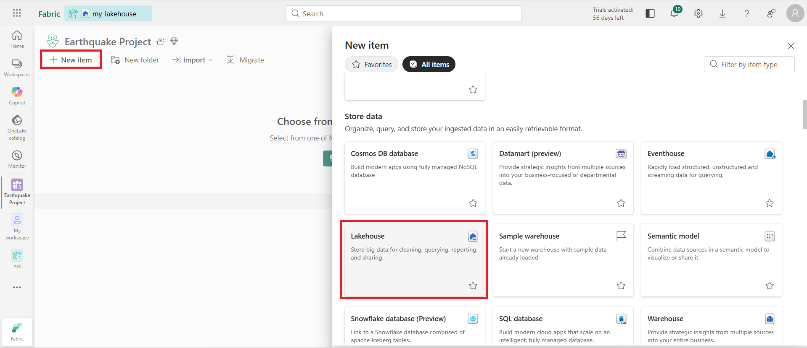
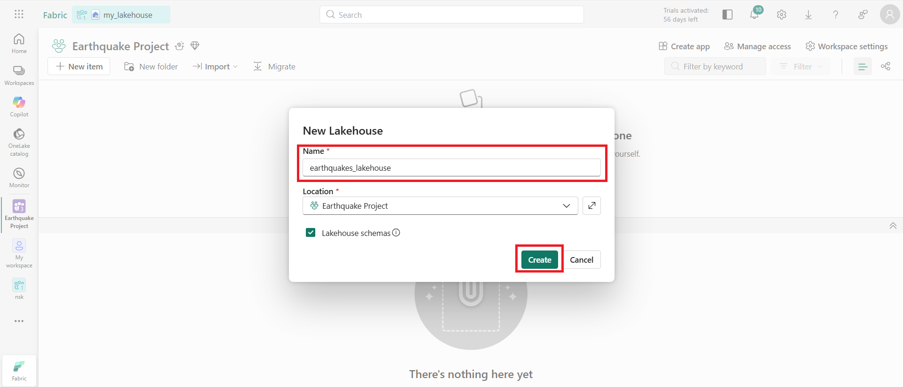
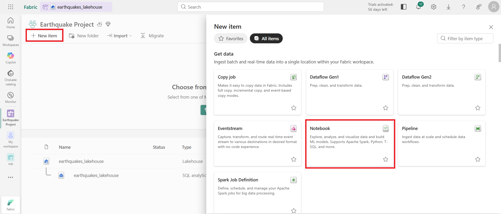
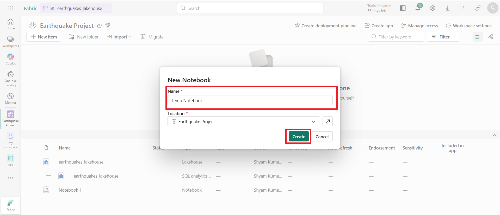
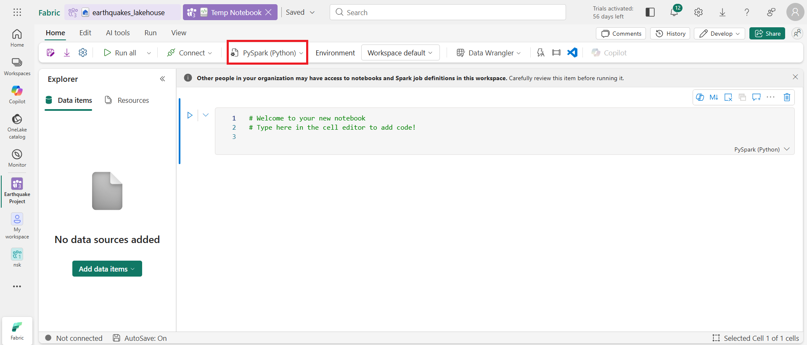
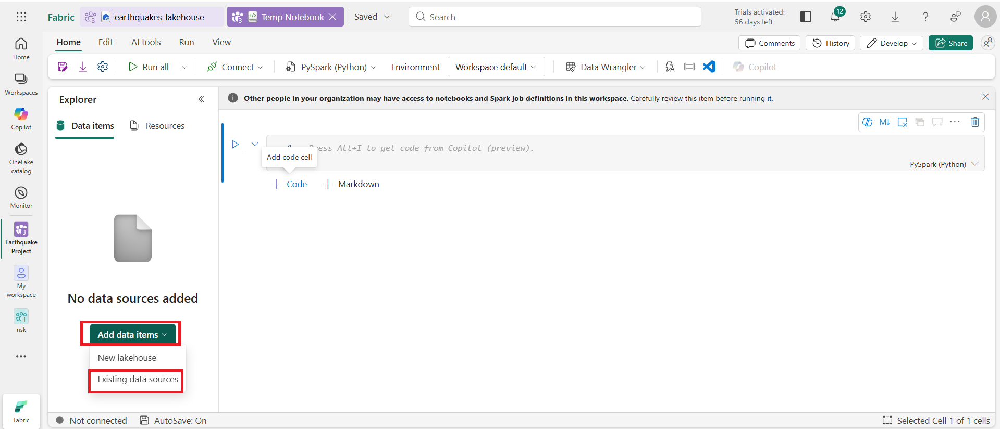
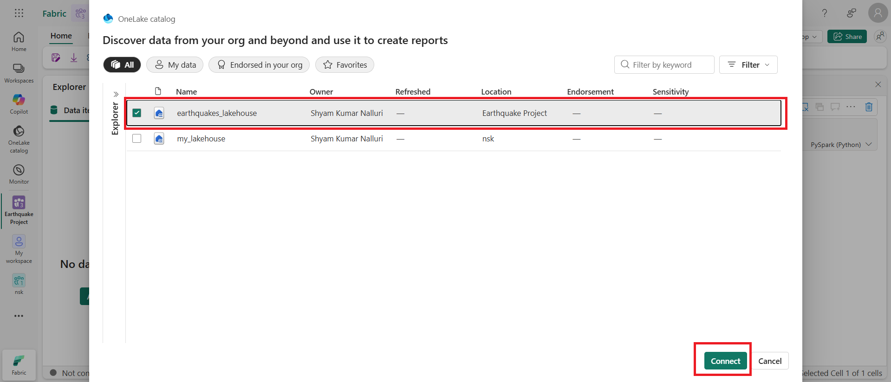
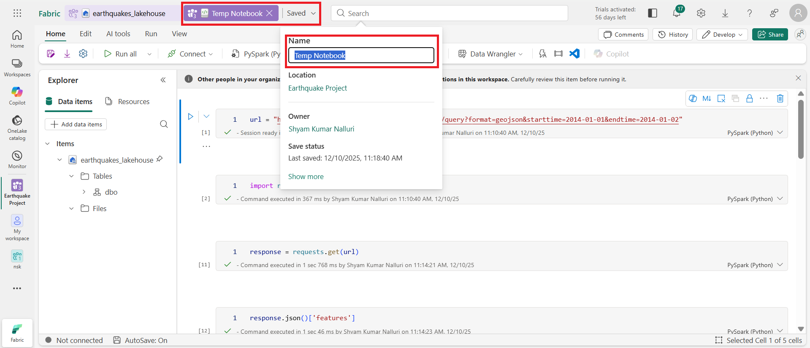

# Earthquake Data Pipeline using Microsoft Fabric

## Project Overview
This project demonstrates an end-to-end ETL pipeline built using **Microsoft Fabric**. [cite_start]It ingests global earthquake data from the USGS API [cite: 3][cite_start], processes it using a **Medallion Architecture** (Bronze, Silver, Gold), and orchestrates the workflow using Fabric Data Pipelines[cite: 23, 24].

[cite_start]The system is designed to run daily [cite: 39, 40][cite_start], processing data incrementally [cite: 34] [cite_start]and enriching it with geospatial details using custom Python libraries[cite: 17, 18, 19].

## Architecture & Tech Stack
* **Platform:** Microsoft Fabric
* [cite_start]**Compute:** Spark (PySpark) [cite: 6]
* [cite_start]**Orchestration:** Fabric Data Pipelines [cite: 23, 24]
* [cite_start]**Data Storage:** OneLake (Lakehouse) [cite: 3]
* [cite_start]**Architecture:** Medallion (Bronze → Silver → Gold) [cite: 9, 15]
* [cite_start]**Source:** [USGS Earthquake API](https://earthquake.usgs.gov/fdsnws/event/1/#parameters) [cite: 3]

---

## Step-by-Step Implementation

### Phase 1: Environment Setup
1.  [cite_start]**Workspace Creation**: A new Fabric workspace named “Earthquake Project” was created[cite: 1, 2].
    
    

2.  [cite_start]**Lakehouse Setup**: A Lakehouse named `earthquakes_lakehouse` was instantiated [cite: 3, 4] to store files and tables.
    
    

### Phase 2: The Bronze Layer (Ingestion)
[cite_start]The Bronze layer is responsible for raw data ingestion[cite: 9].
* **Notebook**: `1. [cite_start]Bronze_layer.ipynb` [cite: 9]
* [cite_start]**Action**: Fetches geoJSON data from the USGS API based on dynamic start and end dates (`start_date` and `end_date`)[cite: 10].
* [cite_start]**Storage**: Saves raw JSON files to the Lakehouse "Files" section[cite: 12, 13].

### Phase 3: The Silver Layer (Transformation)
The Silver layer cleans and structures the data.
* **Notebook**: `2. [cite_start]Silver_layer.ipynb` [cite: 15]
* [cite_start]**Action**: Reads the raw JSON [cite: 2][cite_start], flattens the nested schema (extracting longitude, latitude, magnitude) [cite: 2][cite_start], and casts columns to correct data types (Timestamp)[cite: 2].
* [cite_start]**Storage**: Saves as a Delta Table `earthquake_events_silver`[cite: 2].

[cite_start]*Note: The Silver and Gold layers were created/imported later [cite: 15] [cite_start]and connected to the data source[cite: 16].*

### Phase 4: The Gold Layer (Enrichment)
The Gold layer adds business value by enriching the data.
* **Notebook**: `3. [cite_start]Gold_layer.ipynb` [cite: 15]
* [cite_start]**Custom Environment**: A custom Fabric environment `Earthquake_env` was created [cite: 18] [cite_start]to install the external library `reverse_geocoder`[cite: 17, 19].
* [cite_start]**Action**: Uses reverse geocoding (with the `reverse_geocoder` library) [cite: 3] [cite_start]to determine the "Country Code" from latitude/longitude [cite: 3] [cite_start]and classifies earthquakes as Low, Moderate, or High significance based on the `sig` column[cite: 3].
* [cite_start]**Storage**: Saves the final, enriched data as a Delta Table `earthquake_events_gold`[cite: 3].

### Phase 5: Semantic Model
[cite_start]A new Semantic Model was created using the table from the Lakehouse [cite: 21] [cite_start]to facilitate downstream reporting and BI[cite: 21].

---

## Pipeline Orchestration
[cite_start]To automate the process, a Fabric Data Pipeline was built to run the notebooks sequentially[cite: 23, 26]. 

1.  [cite_start]**Pipeline Setup**: Created a new Pipeline "Earthquake Data Pipeline"[cite: 24, 25].
2.  [cite_start]**Activity Setup**: Notebook activities were added for Bronze, Silver, and Gold layers[cite: 26, 27].
3.  [cite_start]**Dynamic Parameters**: The pipeline passes dynamic dates to the notebooks (`1. Bronze_layer`, `2. Silver_layer`, and `3. Gold_layer`) using Fabric expressions[cite: 29].
    * [cite_start]`start_date` (Yesterday): `@formatDateTime(addDays(utcNow(),-1),'yyyy-MM-dd')` [cite: 31]
    * [cite_start]`end_date` (Today): `@formatDateTime(utcNow(),'yyyy-MM-dd')` [cite: 32]
4.  [cite_start]**Dependency Flow**: The notebooks are connected sequentially: Bronze → Silver → Gold[cite: 34, 36].

---

## Validation & Execution
[cite_start]The pipeline was validated to check for errors[cite: 37].

* [cite_start]**Successful Run**: The pipeline was run [cite: 38] [cite_start]and successfully executed all three layers[cite: 38].

### Scheduling
[cite_start]The pipeline is scheduled to run daily on a fixed time by setting the start and end dates for the recurrence[cite: 39, 40].
